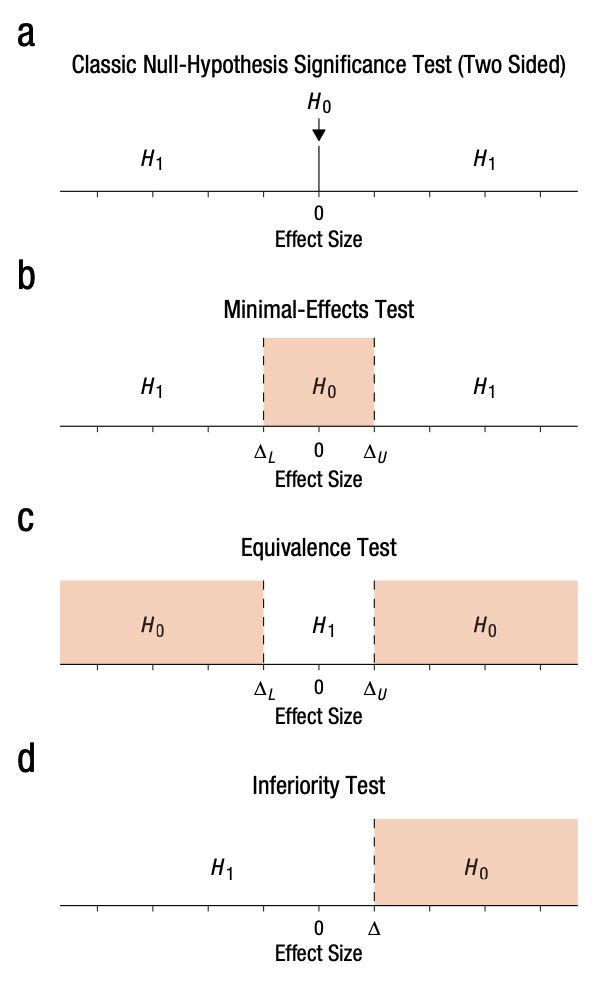

# Citation & License

Citation: 

Ian Hussey (2024) Improving your statistical inferences through simulation studies in R. https://github.com/ianhussey/simulation-course

License: 

[CC BY 4.0](https://creativecommons.org/licenses/by/4.0/deed.en)

```{r, include=FALSE}

# set default chunk options
knitr::opts_chunk$set(message = FALSE,
                      warning = FALSE)

# disable scientific notation
options(scipen = 999) 

```

# Dependencies

```{r}

library(tidyr)
library(dplyr)
library(purrr) 
library(stringr)
library(forcats)
library(ggplot2)
library(scales)
library(patchwork)
library(knitr)
library(kableExtra)
library(janitor)
library(effsize)

```

# Exercise: Power for equivalence test

See Lakens et al., 2018 for a tutorial on the concepts below.

Using a Smallest Effect Size of Interest (SESOI) of Cohen's d = 0.2, what is the power of a Two One-Sided Equivalence Test (TOST) for different sample sizes? What N is needed for 80% power to detect a true null effect size as equivalent to zero?

Note: because reasons, use the 90% Confidence Interval instead of 95 (see Lakens et al., 2018).

```{r}
# functions for simulation
generate_data <- function(n_per_condition,
                          mean_control,
                          mean_intervention,
                          sd) {
  
  data_control <- 
    tibble(condition = "control",
           score = rnorm(n = n_per_condition, mean = mean_control, sd = sd))
  
  data_intervention <- 
    tibble(condition = "intervention",
           score = rnorm(n = n_per_condition, mean = mean_intervention, sd = sd))
  
  data_combined <- bind_rows(data_control,
                             data_intervention) |>
    mutate(condition = fct_relevel(condition, "intervention", "control"))
  
  return(data_combined)
}

analyze <- function(data) {
  
  res_t_test_lower <- t.test(formula = score ~ condition, mu = - .2,
                             data = data,
                             var.equal = TRUE,
                             alternative = "greater")
  
  res_t_test_upper <- t.test(formula = score ~ condition, mu = .2,
                             data = data,
                             var.equal = TRUE,
                             alternative = "less")
  
  res_cohens_d <- effsize::cohen.d(formula = score ~ condition,
                                   data = data,
                                   pooled = TRUE)
  
  res <- tibble(p_lower = res_t_test_lower$p.value,
                p_upper = res_t_test_upper$p.value,
                cohens_d = res_cohens_d$estimate)
  
  return(res)
}

# set seed
set.seed(42)

# simulation parameters
experiment_parameters <- expand_grid(
  n_per_condition = seq(from = 100, to = 450, by = 25),
  mean_control = 0,
  mean_intervention = 0,
  sd = 1,
  iteration = 1:1000
) 

# run simulation
simulation <- experiment_parameters |>
  mutate(generated_data = pmap(list(n_per_condition, 
                                    mean_control,
                                    mean_intervention,
                                    sd),
                               generate_data)) |>
  mutate(results = pmap(list(generated_data),
                        analyze))

# wrangle
simulation_plot <- simulation |>
  unnest(results) |>
  mutate(significant = p_lower < .1 & p_upper < .1) #adjusted for 90% CI

# simulated effect sizes and their significance
simulation_plot |>
  ggplot(aes(n_per_condition*2, cohens_d, color = significant)) +
  geom_jitter(alpha = 0.25) +
  geom_hline(yintercept = 0, linetype = "dotted") +
  scale_x_continuous(breaks = breaks_pretty(n = 10),
                     name = "Total N") +
  scale_y_continuous(breaks = breaks_pretty(n = 10),
                     #limits = c(0,1),
                     name = "Cohen's d") +
  theme_linedraw() +
  scale_color_viridis_d(begin = 0.3, end = 0.7, direction = -1) +
  ggtitle("Population Cohen's d = 0.5")

simulation_summary <- simulation |> 
  unnest(results) |> 
  group_by(n_per_condition) |> 
  summarize(proportion_significant = mean(p_lower < .1 & p_upper < .1)) #again adjusted for 90% CI

# table results
simulation_summary |>
  mutate_if(is.numeric, round_half_up, digits = 2) |>
  kable() |>
  kable_classic(full_width = FALSE)

# plot results
plot <- ggplot(simulation_summary, aes(n_per_condition*2, proportion_significant)) +
  geom_point() +
  geom_line() +
  geom_hline(yintercept = 0.05, linetype = "dotted") +
  geom_hline(yintercept = 0.80, linetype = "solid", color = "#e41a1c", linewidth = 0.5) +
  scale_x_continuous(breaks = breaks_pretty(n = 10),
                     name = "Total sample size") +
  scale_y_continuous(breaks = breaks_pretty(n = 5),
                     limits = c(0,1),
                     name = "Proportion of significant\np-values") +
  labs(title = "Amount of power for a TOST by sample size",
       subtitle = "True null-effect with 90% CI") +
  theme_linedraw() +
  ggtitle("Power of TOST to detect equivalence with true effect size  d = 0 \nand equivalence bounds of +/- 0.2")

plot
```

**Answer:** The TOST reaches a power of 80% at around 325 participants per group, or a total sample of around N = 650.

```{r}

if(exists("materials/lakens et al 2018 figure 1.png")){
  
}

```

# Session info

```{r}

sessionInfo()

```


